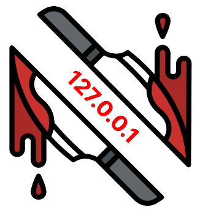
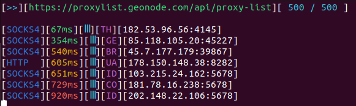

<a name="readme-top"></a>

[![Contributors][contributors-shield]][contributors-url]
[![Forks][forks-shield]][forks-url]
[![Stargazers][stars-shield]][stars-url]
[![Issues][issues-shield]][issues-url]
[![MIT License][license-shield]][license-url]
[![LinkedIn][linkedin-shield]][linkedin-url]


<!-- PROJECT LOGO -->
<br />
<div align="center">
  <a href="https://github.com/Hex2424/ProxyRipper">
    
  </a>

<h3 align="center">ProxyRipper</h3>

  <p align="center">
    A Open-source tool for searching various websites for proxies and doing realtime validation - so THEY WILL REALLY WORK
    <br />
    <!-- <br>
    <a href="https://github.com/Hex2424/ProxyRipper">View Demo</a>
    · -->
    <a href="https://github.com/Hex2424/ProxyRipper/issues">Report Bug</a>
    ·
    <a href="https://github.com/Hex2424/ProxyRipper/issues">Request Feature</a>
  </p>
</div>


<!-- TABLE OF CONTENTS -->
<details>
  <summary>Table of Contents</summary>
  <ol>
    <li>
      <a href="#about-the-project">About The Project</a>
      <ul>
        <li><a href="#built-with">Built With</a></li>
      </ul>
    </li>
    <li>
      <a href="#getting-started">Getting Started</a>
      <ul>
        <li><a href="#prerequisites">Prerequisites</a></li>
        <li><a href="#installation">Installation</a></li>
      </ul>
    </li>
    <li><a href="#usage">Usage</a></li>
    <li><a href="#roadmap">Roadmap</a></li>
    <li><a href="#contributing">Contributing</a></li>
    <li><a href="#license">License</a></li>
    <li><a href="#contact">Contact</a></li>
    <li><a href="#acknowledgments">Acknowledgments</a></li>
  </ol>
</details>


<!-- ABOUT THE PROJECT -->
## About The Project



Proxies, is a safe and pretty fast way to hide your IP online, but finding one online sounds easier than it really is, online websites are overfilled with proxies IPs but actually working ones at that moment is existing only a few, so I decided create a tool for ripping all these websites and finding **REALLY VALID PROXIES**

<p align="right">(<a href="#readme-top">back to top</a>)</p>


### Built With:

* 
* 
<p align="right">(<a href="#readme-top">back to top</a>)</p>


<!-- GETTING STARTED -->
## Getting Started

Project is uploaded to PYPI, so you can install it pretty easily using pip tool.

### Installation

1. Install package using pip command
   ```sh
   pip install ProxyRipper
   ```
2. Congrats, thats all, package is installed

<p align="right">(<a href="#readme-top">back to top</a>)</p>


<!-- USAGE EXAMPLES -->
## Usage

To use this tool with default settings simply type this in your terminal:
```sh
ProxyRipper
```
<br>**Additional arguments:**
<br>Displaying all possible parameters:
```sh
ProxyRipper --help
```
Changing proxy check timeout:
```sh
ProxyRipper --timeout <TIMEOUT>
```
Changing proxy retries until proxy considered died:
```sh
ProxyRipper --attempts <ATTEMPTS>
```
Changing tool threads count used for proxy checking:
```sh
ProxyRipper --threads <THREAD_COUNT>
```
By default tool caches last session working proxies, and firstly checking them, then searching internet for new ones, you can disable this by including this parameter:
```sh
ProxyRipper --disable-cache
```
Tool uses python requests module for checking if proxy do a job properly, by default it tries reach https://myip.com, you can change default checking url by this option.
```sh
ProxyRipper --check-url https://www.example.com
```
Getting version of this tool
```sh
ProxyRipper --version
```

<p align="right">(<a href="#readme-top">back to top</a>)</p>


<!-- ROADMAP -->
## Roadmap

- [ ] Adding more API endpoints for ripping
- [ ] Adding feature to generate PROXY addresses itself
- [ ] Auto proxy revalidation

See the [open issues](https://github.com/Hex2424/ProxyRipper/issues) for a full list of proposed features (and known issues).

<p align="right">(<a href="#readme-top">back to top</a>)</p>


<!-- CONTRIBUTING -->
## Contributing

Contributions are what make the open source community such an amazing place to learn, inspire, and create. Any contributions you make are **greatly appreciated**.

If you have a suggestion that would make this better, please fork the repo and create a pull request. You can also simply open an issue with the tag "enhancement".
Don't forget to give the project a star! Thanks again!

1. Fork the Project
2. Create your Feature Branch (`git checkout -b feature/AmazingFeature`)
3. Commit your Changes (`git commit -m 'Add some AmazingFeature'`)
4. Push to the Branch (`git push origin feature/AmazingFeature`)
5. Open a Pull Request

Project has flexible python API object inheritence from parent API scrapping object, need more API Endpoints for scrapping in "api" folder, template is ProxyEngine.py file, which is template reference for other classes.

<p align="right">(<a href="#readme-top">back to top</a>)</p>


<!-- LICENSE -->
## License

Distributed under the MIT License. See `LICENSE.txt` for more information.

<p align="right">(<a href="#readme-top">back to top</a>)</p>


<!-- CONTACT -->
## Contact

* Markas Vielavičius - markas.vielavicius@gmail.com
* Discord - Hex24#8712

Project Link: [https://github.com/Hex2424/ProxyRipper](https://github.com/Hex2424/ProxyRipper)

<p align="right">(<a href="#readme-top">back to top</a>)</p>


<!-- ACKNOWLEDGMENTS -->
## Acknowledgments

* [https://stackoverflow.com/](https://stackoverflow.com/)

<p align="right">(<a href="#readme-top">back to top</a>)</p>


<!-- MARKDOWN LINKS & IMAGES -->
<!-- https://www.markdownguide.org/basic-syntax/#reference-style-links -->
[contributors-shield]: https://img.shields.io/github/contributors/Hex2424/ProxyRipper.svg?style=for-the-badge
[contributors-url]: https://github.com/Hex2424/ProxyRipper/graphs/contributors
[forks-shield]: https://img.shields.io/github/forks/Hex2424/ProxyRipper.svg?style=for-the-badge
[forks-url]: https://github.com/Hex2424/ProxyRipper/network/members
[stars-shield]: https://img.shields.io/github/stars/Hex2424/ProxyRipper.svg?style=for-the-badge
[stars-url]: https://github.com/Hex2424/ProxyRipper/stargazers
[issues-shield]: https://img.shields.io/github/issues/Hex2424/ProxyRipper.svg?style=for-the-badge
[issues-url]: https://github.com/Hex2424/ProxyRipper/issues
[license-shield]: https://img.shields.io/github/license/Hex2424/ProxyRipper.svg?style=for-the-badge
[license-url]: https://github.com/Hex2424/ProxyRipper/blob/master/LICENSE.txt
[linkedin-shield]: https://img.shields.io/badge/-LinkedIn-black.svg?style=for-the-badge&logo=linkedin&colorB=555
[linkedin-url]: https://linkedin.com/in/markas-vielavičius-503827254
[product-screenshot]: images/screenshot.png
